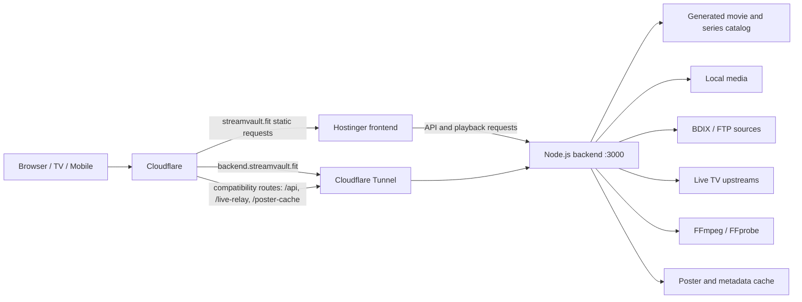

# StreamVault / Insomnia Tapes

A self-hosted streaming and media-discovery platform for movies, series, live TV, and a redirect-based software/download catalog.

> **Production:** [streamvault.fit](https://streamvault.fit)  
> **Backend:** [backend.streamvault.fit](https://backend.streamvault.fit)  
> **Repository:** `yuvhranimeher/streamvault`

## Current production status

| Component | Production role |
|---|---|
| Frontend | Static deployment on Hostinger |
| Backend | Node.js/Express on a Windows 10 Mac mini |
| Public routing | Cloudflare DNS, cache rules, and Cloudflare Tunnel |
| Backend origin | `http://127.0.0.1:3000` on the Mac mini |
| Catalog | 22,171 movies and 3,431 series in the current generated catalog |
| Media sources | Local media plus BDIX/FTP catalogs |
| Playback | Direct HTTP range playback first; HLS/FFmpeg compatibility paths when required |
| Experimental backend | Haskell shadow/parity migration; not the production backend |

The frontend and backend are intentionally separated. The site shell can remain available when the Mac mini is offline, while search, dynamic APIs, playback, and live relay fail gracefully until the backend returns.

## Architecture



### Production request flow

1. `streamvault.fit` serves the static UI from Hostinger.
2. `hostinger/runtime-config.js` defines `https://backend.streamvault.fit` as the backend origin.
3. Cloudflare Tunnel forwards backend traffic to the Mac mini on port `3000`.
4. Compatibility rules on the primary domain can forward `/api/*`, `/live-relay/*`, and `/poster-cache*` to the same backend.
5. Static images, CSS, JavaScript, SVG, and fonts may be cached by Cloudflare; API and live-stream routes must not be cached as static content.

## Core capabilities

### Movies and series

- Large generated movie and series catalogs
- Curated Netflix-style discovery rows
- Full-catalog search beyond homepage items
- Movie and series detail modals
- Seasons, episodes, metadata, artwork, trailers, and similar titles
- Watch history, continue watching, and progress persistence
- Responsive movie and series browsing

### Homepage and discovery

The homepage uses a compact prebuilt feed, progressive row rendering, poster optimization, deduplication, and lazy loading. Current collections include studio, language, genre, mood, franchise, recently added, top-rated, and activity-based rows.

Homepage sections are treated as production-critical and must not be removed during backend, catalog, or frontend refactors.

### Playback

The playback strategy is deliberately conservative:

1. Prefer direct playback of the original source.
2. Preserve HTTP `Range` support for seeking.
3. Use native HLS where supported.
4. Use HLS.js as the browser fallback.
5. Use FFmpeg only for incompatible codecs, containers, mobile compatibility, or heavy-content fallback.
6. Preserve audio-track and subtitle selection.
7. Keep manual language switching available after automatic track selection.

Desktop direct play must not be replaced with unnecessary transcoding.

### Live TV

- Channel data is loaded from `channels.json`
- Sports, news, entertainment, movie, and children’s categories are supported
- Channel cards include logos and availability metadata
- Public playback uses the backend live relay
- Relay sessions expose status and stop controls
- Upstream streams may not provide adaptive-bitrate variants, so buffering can still depend on the source

### Software and download catalog

- Windows, Android, games, console files, operating systems, and archives
- Filtered and searchable card interface
- Progressive rendering for large datasets
- Redirect-based downloads to avoid proxying large files through the Mac mini
- Download route: `/download/:id`

### Posters and artwork

- TMDB artwork enrichment
- Poster proxy/cache support
- Device-aware image sizing
- Lazy loading and eager loading budgets
- Backdrop and placeholder fallbacks
- High-resolution movie and series detail artwork
- Protection against late low-resolution image replacement

## Technology stack

### Frontend

- HTML5
- CSS
- Vanilla JavaScript
- Versioned Service Worker
- HLS.js
- Native browser media APIs
- Hostinger static hosting

### Backend

- Node.js
- Express.js
- CommonJS
- JSON-generated catalogs and caches
- FFmpeg and FFprobe
- HTTP range streaming
- Live TV relay
- TMDB/metadata enrichment

### Infrastructure

- Windows 10 production host
- Cloudflare Tunnel
- Cloudflare DNS and static-asset caching
- Hostinger frontend hosting
- Git and GitHub release tags
- Tailscale/SSH for remote administration

### Experimental migration

- Haskell backend prototypes
- Shadow API execution
- JSON parity testing
- Route-by-route migration only

Node.js remains the production backend. Playback, live relay, and FFmpeg routes must migrate last.

## Repository layout

```text
streamvault/
├── hostinger/                  # Production static frontend
│   ├── index.html
│   ├── runtime-config.js
│   ├── app-v3.js
│   ├── home.js
│   ├── details.js
│   ├── downloads.js
│   ├── styles.css
│   └── sw-20260714-v4.js
├── server.js                   # Production Node.js backend
├── channels.json               # Live TV channel definitions
├── catalog.json                # Generated movie/series catalog
├── scan-output/                # Scanner output and cleaned catalogs
├── cache/                      # HLS and runtime cache data
├── middleware/                 # Request tracking and middleware
├── routes/                     # Dashboard and modular routes
├── package.json
└── README.md
```

Some branches may retain legacy root frontend files for rollback or migration compatibility. The production frontend source of truth is the Hostinger-specific frontend tree on the active frontend branch.

## Important backend routes

### Status and catalogs

- `GET /api/version`
- `GET /api/home-feed`
- `GET /api/catalog-stats`
- `GET /api/movies`
- `GET /api/series`
- `GET /api/search`
- `GET /api/section/:key`
- `GET /api/title-details`
- `GET /api/details/:type/:id`

### Playback and media

- `GET /api/playback/local/:id`
- `GET /api/playback/local/:id/stream`
- `GET /stream/:id`
- `GET /api/playback/ftp`
- `GET /api/ftp/stream`
- `GET /api/ftp/proxy`
- `GET /api/mobile-hls/local/:id/index.m3u8`
- `GET /api/mobile-hls/ftp/index.m3u8`
- `GET /api/media-info/:id`
- `GET /api/duration/:id`
- `GET /api/qualities/:id`
- `GET /api/subtitles/:id`

### Live TV

- `GET /api/channels`
- `GET /live-relay/:channelId/index.m3u8`
- `GET /live-relay/:channelId/:file`
- `GET /api/live-relay/status`
- `POST /api/live-relay/stop`

### Artwork and downloads

- `GET /poster-cache`
- `GET /api/downloads`
- `GET /download/:id`

Route behavior can vary between branches. Check `server.js` before changing frontend contracts.

## Local backend setup

### Requirements

- Node.js
- npm
- FFmpeg
- FFprobe
- Access to the configured catalogs or media sources

### Install

```bash
npm install
```

### Run

```bash
node server.js
```

The backend listens on port `3000` unless `PORT` is provided.

### Verify

```bash
curl http://127.0.0.1:3000/api/version
curl http://127.0.0.1:3000/api/catalog-stats
curl http://127.0.0.1:3000/api/channels
```

## Configuration

Common runtime settings include:

- `PORT`
- `FFMPEG_BIN` or `FFMPEG_PATH`
- `FFPROBE_BIN` or `FFPROBE_PATH`
- `OMDB_API_KEY`
- `YOUTUBE_API_KEY`
- `MOBILE_HLS_IDLE_MS`
- `MOBILE_HLS_MAX_SESSIONS`
- `MOBILE_HLS_FFMPEG_THREADS`
- `MOBILE_HLS_MAX_WIDTH`
- `MOBILE_HLS_MAX_FPS`
- `MOBILE_HLS_VIDEO_MAXRATE`
- `MOBILE_HLS_VIDEO_BUFSIZE`
- `MOBILE_HLS_AUDIO_BITRATE`

The frontend backend origin is configured separately in `hostinger/runtime-config.js`.

Do not commit API tokens, tunnel credentials, private upstream URLs, or machine-specific secrets.

## Service Worker and caching

Production uses a versioned service worker rather than relying only on an unversioned `sw.js`.

Current frontend baseline:

```text
/sw-20260714-v4.js
```

Rules:

- register with `updateViaCache: "none"`
- version cache namespaces when frontend assets change
- serve `/`, `/index.html`, and service-worker files without stale HTML caching
- cache static assets such as images, CSS, JavaScript, SVG, and fonts
- do not cache `/api/*` or `/live-relay/*` as static files
- retain graceful offline behavior for the frontend shell

## Performance rules

- Never render the full catalog in one DOM operation
- Paginate or progressively render large result sets
- Keep the homepage feed compact and prebuilt
- Lazy-load noncritical artwork
- Limit eager image requests
- Deduplicate titles and poster identities across homepage rows
- Avoid blocking metadata work during first paint
- Preserve HTTP range streaming and seek behavior
- Limit concurrent FFmpeg sessions
- Clean idle HLS sessions and temporary cache files
- Keep backend failures from breaking the static frontend shell

## Production safety rules

Before deployment, preserve all of the following:

- Desktop direct playback
- Mobile playback fallback
- Movie and series hydration
- Live TV relay
- Audio and subtitle selection
- Search across the full catalog
- Homepage rows and ordering
- Poster cache behavior
- High-resolution detail artwork
- Continue watching and watch history
- Download redirects
- Service-worker update behavior
- Backend URL normalization
- Offline/online state recovery

Do not deploy broad playback changes together with unrelated UI or catalog refactors.

## Branch and release strategy

- `hostinger-frontend-only` — production-oriented static frontend branch
- `stable-production-macmini` — Mac mini production baseline
- feature branches — isolated playback, audio, UI, Haskell, and infrastructure work
- annotated tags — stable rollback points before and after production changes

Known production checkpoints include:

- `stable-hostinger-playback-20260714`
- `stable-before-audio-livev2-20260715`
- `stable-production-frontend-20260716`
- `production-modal-hd-artwork-20260716`
- `production-modal-hd-artwork-v2-20260716`

Experimental branches must not be merged into production without browser, playback, backend, and rollback verification.

## Haskell migration policy

The long-term migration remains incremental:

1. Low-risk read-only APIs
2. Download and catalog endpoints
3. Homepage and section APIs
4. Search and details APIs
5. Live TV metadata APIs
6. Playback planning
7. Direct streams, relay, and FFmpeg last

Each Haskell route must match the Node.js JSON contract before frontend traffic is switched.

## Legal and operational notice

StreamVault is a personal, self-hosted engineering project. Only index, stream, or distribute media and downloadable files that you are legally authorized to use. Repository documentation must not expose private infrastructure credentials or protected upstream sources.

## Project priorities

1. Playback stability
2. Frontend availability independent of backend uptime
3. Fast catalog discovery and search
4. Reliable poster and metadata delivery
5. Low backend bandwidth through direct play and redirects
6. Controlled FFmpeg usage
7. Safe, reversible infrastructure migration
